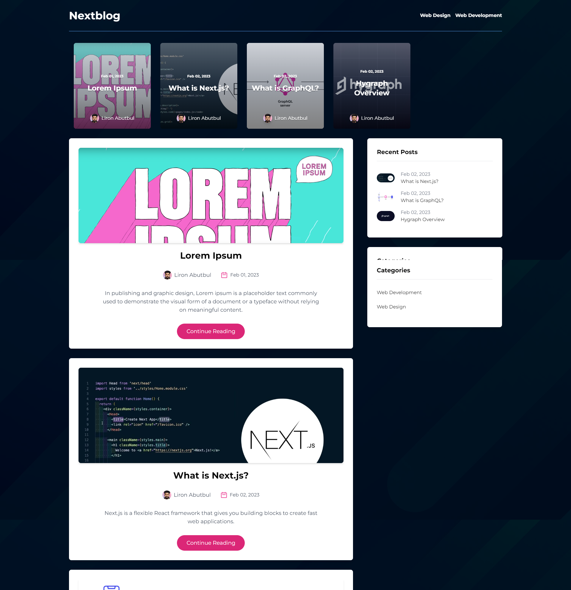

<a name="readme-top"></a>
<div align="center">

  
  

  <h1>Nextblog</h1>
  
  <p>
    <b>Nextblog</b> is the best GraphQL Blog Application with everything you can imagine - built with NextJS
  </p>
  
<!-- Badges -->
<p>
  <a href="https://github.com/ladunjexa/GraphQL-Nextblog/graphs/contributors">
    
  </a>
  <a href="">
    
  </a>
  <a href="https://github.com/ladunjexa/GraphQL-Nextblog/network/members">
    
  </a>
  <a href="https://github.com/ladunjexa/GraphQL-Nextblog/stargazers">
    
  </a>
  <a href="https://github.com/ladunjexa/GraphQL-Nextblog/issues/">
    
  </a>
  <a href="https://github.com/ladunjexa/GraphQL-Nextblog/blob/master/LICENSE">
    
  </a>
</p>
   
 <h4>
    <a href="https://GraphQL-Nextblog.vercel.app/">View Demo</a>
  <span> · </span>
    <a href="https://github.com/ladunjexa/GraphQL-Nextblog">Documentation</a>
  <span> · </span>
    <a href="https://github.com/ladunjexa/GraphQL-Nextblog/issues/">Report Bug</a>
  <span> · </span>
    <a href="https://github.com/ladunjexa/GraphQL-Nextblog/issues/">Request Feature</a>
  </h4>
</div>

<br />

<!-- Table of Contents -->
<details>

<summary>

# :notebook_with_decorative_cover: Table of Contents

</summary>

- [About the Project](#star2-about-the-project)
  * [Folder Structure](#bangbang-folder-structure)
  * [Envirnoment Variables](#key_environment-variables)
  * [Tech Stack](#space_invader-tech-stack)
- [Getting Started](#toolbox-getting-started)
  * [Installation](#gear-installation)
- [Contributing](#wave-contributing)
- [License](#warning-license)
- [Contact](#handshake-contact)
- [Acknowledgements](#gem-acknowledgements)

</details>  

<!-- About the Project -->
## :star2: About the Project

<p align="center"> 
  
</div>
<br />

***Nextblog*** is an outstanding Blog Application with featured and recent posts, categories, full markdown articles, author information, comments, and much more, works with Hygraph. hygraph is a headless content management system based on GraphQL technology enabling seamless integration with any application.


<!-- Folder Structure -->
### :bangbang: Folder Structure

<b>Nextblog</b> code folder structure
```
Nextblog/
|- components/
|- pages/
  |-- api/
  |-- category/
  |-- post/
|- sections/
|- services/
|- styles/
```

Now, lets dive into the main folder

### components

`Author.jsx` - `Categories.jsx` - `Comments.jsx` - `CommentsForm.jsx` - `FeaturedPostCard.jsx` - `Header.jsx` - `Layout.jsx` - `Loader.jsx` - `PostCard.jsx` - `PostDetail.jsx` - `PostWidget` - `index.js`

This folder contains all React Components, which they're independent and reusable bits of code. They serve the UI (User Interface) of ***Nextblog*** to avoid unnecessary repetition of the code.
those components are beautiful customized widgets using TailwindCSS to describe theme for widgets as they're named.

### pages

`_app.js` - `index.js` - `category` - `post` - `api`

this folder contains activities / scenes of application as a exported react arrow function components.
this folder contains a well-structured activities / scenes of applications using NextJS Best Practices.
Nextblog includes Home page, Dynamic Categories & Blogposts pages.

### sections

`FeaturedPosts.jsx` file implement the featured posts sections using `React-Multi-Carousel`

### services

`index.js` - This script exports multiple GraphQL queries for a blog website. The queries retrieve information about posts, post details, recent posts, similar posts, featured posts, adjacent posts, posts belonging to a specific category, and categories. The queries use the GraphQL request library to send the queries to the Hygraph endpoint specified in the graphqlAPI environment variable.

For example, Here is `getPostDetails` function
```javascript
export const getSimilarPosts = async (categories, slug) => {
  const query = gql`
    query GetPostDetails($slug: String!, $categories: [String!]) {
      posts(
        where: {
          slug_not: $slug
          AND: { categories_some: { slug_in: $categories } }
        }
        last: 3
      ) {
        title
        featuredImage {
          url
        }
        createdAt
        slug
      }
    }
  `;

  const result = await request(graphqlAPI, query, { categories, slug });

  return result.posts;
};
  ```
  
### styles

`global.scss` file is the stylesheet file written in SCSS and uses the Tailwind CSS framework. It defines the default styles and custom styles for the HTML elements and components used in a web page. 

<p align="right">(<a href="#readme-top">back to top</a>)</p>

<!-- ENV VARIABLES -->
### :key: Environment Variables

In order to use ***Nextblog*** you have to add the following environment variable to your .env file

```env
NEXT_PUBLIC_GRAPHCMS_ENDPOINT=<HYGRAPH_ENDPOINT>
GRAPHCMS_TOKEN=<HYGRAPH_TOKEN>
```

<!-- TechStack -->
### :space_invader: Tech Stack


<p align="right">(<a href="#readme-top">back to top</a>)</p>

<!-- Getting Started -->
## 	:toolbox: Getting Started

<!-- Installation -->
### :gear: Installation

#### Step 1:
Download or clone this repo by using the link below:

```bash
 https://github.com/ladunjexa/GraphQL-Nextblog
```

#### Step 2:

***Nextblog*** using `NPM` (Node Package Manager) `Yarn`, therefore, make sure that Node.js is installed by execute the following command in consle

```bash
  node -v
```

### Step 3:

Go to root folder and execute the following command to get the required packages:

```bash
  npm install
```

### Step 4:

At the root folder execute the following command in order to run the development sever:

```bash
  npm run dev
  #or
  yarn dev
```

<p align="right">(<a href="#readme-top">back to top</a>)</p>

<!-- Contributing -->
## :wave: Contributing

<a href="https://github.com/ladunjexa/GraphQL-Nextblog/graphs/contributors">
  
</a>

Contributions are always welcome!

See [`contributing.md`](https://contributing.md/) for ways to get started.

Contributions are what make the open source community such an amazing place to learn, inspire, and create. Any contributions you make are **greatly appreciated**.

If you have a suggestion that would make this better, please fork the repo and create a pull request. You can also simply open an issue with the tag "enhancement".
Don't forget to give the project a star! Thanks again!

1. Fork the Project
2. Create your Feature Branch (`git checkout -b feature/AmazingFeature`)
3. Commit your Changes (`git commit -m 'Add some AmazingFeature'`)
4. Push to the Branch (`git push origin feature/AmazingFeature`)
5. Open a Pull Request

<p align="right">(<a href="#readme-top">back to top</a>)</p>

<!-- License -->
## :warning: License

Distributed under the MIT License. See [LICENSE.txt](https://github.com/ladunjexa/GraphQL-Nextblog/blob/main/LICENSE) for more information.

<p align="right">(<a href="#readme-top">back to top</a>)</p>

<!-- Contact -->
## :handshake: Contact

Liron Abutbul - [@lironabutbul6](https://twitter.com/lironabutbul6) - [@ladunjexa](https://t.me/ladunjexa)

Project Link: [https://github.com/ladunjexa/GraphQL-Nextblog](https://github.com/ladunjexa/GraphQL-Nextblog)

<p align="right">(<a href="#readme-top">back to top</a>)</p>

<!-- Acknowledgments -->
## :gem: Acknowledgements

This section used to mention useful resources and libraries (packages) that used in Nextblog application project.

 - [React](https://reactjs.org/)
 - [Next.js](https://nextjs.org/)
 - [Sass](https://sass-lang.com/)
 - [TailwindCSS](https://tailwindcss.com/)
 - [GraphQL](https://graphql.org/)
 - [GraphQL-Request](https://www.npmjs.com/package/graphql-request)
 - [HTML-React-Parser](https://www.npmjs.com/package/html-react-parser)
 - [Moment.js](https://momentjs.com/)
 - [React-Multi-Carousel](https://www.npmjs.com/package/react-multi-carousel)
 - #JSMastery

<p align="right">(<a href="#readme-top">back to top</a>)</p>
